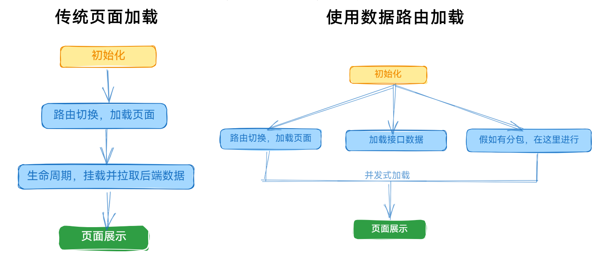

## 官网

查看[官方文档v6](https://reactrouter.com/en/main/start/faq)

## 安装

```shell
npm i react-router-dom
```

浏览器专用库：`react-router-dom`

移动端专用库：`react-router-native`

## 路由模式

### 使用方法

`index.js`

```react
root.render(
  // 路由模式
  <BrowserRouter>
    <Routes>
      <Route path="/a" element={<A />} />
      <Route path="/b" element={<B />} />
    </Routes>
  </BrowserRouter>
);
```

几种模式：

​		`BrowserRouter` 

​		`HashRouter`

​		`MemoryRouter`适用于单元测试

​		`NativeRouter`适用于移动端环境

​		`StaticRouter`


## Outlet标签

相当于 `router-view` 

### 使用方法

`layout/index.js`

```react
import { Outlet } from "react-router-dom";

function Layout() {
  return (
    <>
      <div>标题</div>
      <div>
        内容区域:<Outlet></Outlet>
      </div>
    </>
  );
}

export default Layout;
```


`views/a.js`

```react
function A() {
  return <div>A组件</div>;
}

export default A;
```


`index.js`

```react
import Layout from "./layout";
import A from "./views/a";
root.render(
  // 路由模式
  <BrowserRouter>
    <Routes>
      <Route path="/" element={<Layout />}>
        <Route path="/a" element={<A />}></Route>
      </Route>
    </Routes>
  </BrowserRouter>
);
```


## hooks

### useNavigate

可传递状态参数：

`layout/index.js`

```react
import { Outlet, useNavigate } from "react-router-dom";

export default function Layout() {
  const navigate = useNavigate();
  return (
    <>
      <div>顶部</div>
      <div>
        <button onClick={() => navigate("a", { state: { id: new Date().getTime() } })}>
          跳转A
        </button>
        <button onClick={() => navigate("b")}>跳转B</button>
      </div>
      <div>
        内容区域:
        <Outlet></Outlet>
      </div>
    </>
  );
}
```


`index.js`

```react
import Layout from "./layout";
import A from "./views/a";
import B from "./views/b";
root.render(
  // 路由模式
  <BrowserRouter>
    <Routes>
      <Route path="/" element={<Layout />}>
        <Route path="/a" element={<A />}></Route>
        <Route path="/b" element={<B />}></Route>
      </Route>
    </Routes>
  </BrowserRouter>
);

```


### useLocation

结合 `useNavigate` 获取路由传递的状态：

`views/a.js`

```react
import { useLocation } from "react-router-dom";

function A() {
  const location = useLocation();
  return <div>A组件:{location.state.id}</div>;
}

export default A;
```


## 动态路由

`index.js`

```react
root.render(
  <BrowserRouter>
    <Routes>
      <Route path="/" element={<Layout />}>
        {/* 访问时必须添加上参数 */}
        <Route path="/user/:id" element={<User />}></Route>
      </Route>
    </Routes>
  </BrowserRouter>
);
```


### useParams

可以拿取路由信息：

`views/user.js`

```react
import { useParams } from "react-router-dom";

export default function User() {
  const params = useParams(); // params = {id: '1719809506217'}
  return (
    <>
      <div>User:{params.id}</div>
    </>
  );
}
```


`layout.js`

```react
import { Outlet, useNavigate } from "react-router-dom";

export default function Layout() {
  const navigate = useNavigate();
  return (
    <>
      <div>顶部</div>
      <div>
        <button onClick={() => navigate("user/" + new Date().getTime())}>
          跳转A
        </button>
      </div>
      <div>
        内容区域:
        <Outlet></Outlet>
      </div>
    </>
  );
}

```


但是形如 `http://localhost:3000/user/1719809558346?name=janly&&pwd=123`

是获取不到的

需要使用 `useSearchParams` 获取


### useSearchParams

访问 `http://localhost:3000/user/1719809558346?name=janly&&pwd=123`，返回数组对象：

```react
import { useParams, useSearchParams } from "react-router-dom";
export default function User() {
  const [searchParams, setParams] = useSearchParams();
  const params = useParams();
  return (
    <>
      <div>User:{params.id}</div>
    </>
  );
}
```

通过 searchParams 原型上方法进行获取 ，例如：

```react
searchParams.get("name")
```

searchParams 包括了增删改查功能函数，改变当前 url 中查询字符串

## 跳转路由

① 通过 hook useNavigate

② 通过 Link 标签


>  <button onClick={() => navigate("user/1829454598")}>跳转A</button>{" "}
>
>  <Link to="user/1829454598">跳转A</Link>


## useMatch

```react
import { useMatch } from "react-router-dom";

export default function User() {
  const match = useMatch("user");
  return (
    <>
      <div>User</div>
    </>
  );
}
```

当前访问路径为 `/user` 时 `match` 才有值


## 数据路由





传统路由切换时需要拉取分包、拉数据，整个过程是一个串行的流程，导致常见的瀑布流问题


使用方法：

```react
import {
  createBrowserRouter,
  RouterProvider,
  createRoutesFromElements,
  Route,
} from "react-router-dom";

const router = createBrowserRouter(
  createRoutesFromElements(
    <Route path="/" element={<Layout></Layout>}>
      <Route path="/user" element={<User />}></Route>
    </Route>
  )
);

root.render(<RouterProvider router={router} />);
```


开启分包：

```JavaScript
const User = React.lazy(() => import('./views/user'))
```


打包之后会单独生成一个JS文件

