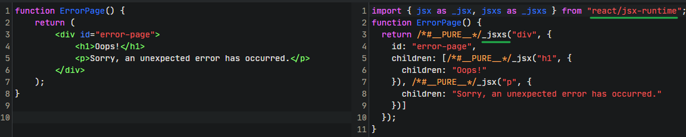
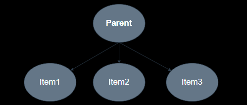

## 官网

React官网：https://react.docschina.org/


## 安装React运行环境

https://github.com/facebook/create-react-app

```shell
npx create-react-app my- app
```

## 入口文件

```js
import React from "react";
import ReactDOM from "react-dom/client";
import App from "./App.tsx";

// 性能分析组件，浏览器lighthouse面板查看
import reportWebVitals from "./reportWebVitals";

ReactDOM.createRoot(document.getElementById("root")!).render(
    <React.StrictMode>
        <App />
    </React.StrictMode>,
);
```


React的严格模式：`<React.StrictMode>`

```js
警告作用：
	1、当前版本被废弃的API、方法、生命周期等
	2、不兼容的代码、错误的代码
	3、发现意外的副作用
```


## 为什么react和react-dom是两个库

- `react`：React核心库，用于创建组件和生命周期方法，可视为React的“引擎”。
- `react-dom`：只做和浏览器或DOM相关的操作，例如将React组件渲染到DOM中，或者在DOM中触发React组件的更新。提供了在浏览器环境中使用React的方法，可视为React的“驱动程序”。

分为两个包：功能解耦（`react-dom` 还可以提供浏览器、服务端、原生客户端等等）


## JSX

在JS中书写DOM，经过 babel 编译：



使用 `_jsx`方法生成 DOM，来源于 `react/jsx-runtime`库


## 类组件

使用 `extends`继承 `React.Component` 实现（已被官方推荐废弃）

### 生命周期函数

```js
import React from "react";

class App extends React.Component {
    constructor(props) {
        super(props);
        console.log("1 step execute constructor");
    }

    static getDerivedStateFromProps(props, state) {
        console.log("2 step execute getDerivedStateFromProps");
        return null;
    }

    componentDidMount() {
        console.log("4 step execute componentDidMount");
    }

    render() {
        console.log("3 step execute render");
        return (
            <>
                <div>类组件</div>
            </>
        );
    }
}

export { App };

```


### 状态更新

```js
class App extends React.Component {
    constructor(props) {
    	...
        // 定义状态
        this.state = { name: "kk" };
    }
    
    // 修改事件
    changeName = () => {
        this.setState({
            name: "jj",
        });
    };

    render() {
        const { name } = this.state;
        return (
            <>
                <div>类组件</div>
                <div>{name}</div>
                <button onClick={this.changeName}>修改Name</button>
            </>
        );
    }
}
```


这里点击修改之后会再次执行` getDerivedStateFromProps、render` 生命周期


### getDerivedStateFromProps

`static getDerivedStateFromProps(props, state)`  静态方法，需要结合更新状态使用


props：组件即将更新的传参

state：组件即将更新的状态（ this.state ）

```js
static getDerivedStateFromProps(props, state) {
    console.log("2 step execute getDerivedStateFromProps");
    return {
        name: "new Name is kangkang",
    };
}
```


直接对  state 中的 name 进行了覆盖 ， changeName 执行后触发了` getDerivedStateFromProps、render` 生命周期


在 **挂载** 和 **更新** 阶段都会执行


总结：`getDerivedStateFromProps`的返回值会对`state`中相同属性进行强行覆盖修改


### componentDidUpdate

`componentDidUpdate(prevProps, prevState, snapshot)` 

prevProps \ prevState：上一次的值

snapshot：钩子函数 <a href="#getsnapshotbeforeupdate">getSnapshotBeforeUpdate</a> 的返回值


### getSnapshotBeforeUpdate

`getSnapshotBeforeUpdate(prevProps, prevState)`  

`prevProps、prevState`：上一次的值；只会在更新阶段执行，在`render`之后，浏览器页面更新之前执行；

::: danger

更新函数执行不代表页面真的更新了

:::


 **return** 的值会作为参数传递给 `componentDidUpdate`

应用场景

- 长列表，需要不断的往里面塞入内容
- 更新之前，记住滚轮的位置，传递给componentDidUpdtate，保持滚轮的位置
- getSnapshotBeforeUpdate 更新之前记录滚轮的原始位置，传递给 componentDidUpdtate
- componentDidUpdtate 就使用原始的位置更新dom，保证滚轮的正确性


## 函数组件


```js
const Home = () => {
    return (
        <>
            <h2>函数组件</h2>
        </>
    );
};

export default Home;
```


## Hooks


- 都不能写在 条件判断 以及 函数内部，只能写在组件的 **顶级作用域**，因为 hooks 底层是链表结构，由 next 属性保证顺序执行


### [useEffect](https://react.docschina.org/reference/react/useEffect)


参数：

 - setup
   - 更新的回调函数，组件初始化执行，组件更新之后会执行（dom更新完成）
 - dependencies?
   - 数据依赖，类似 vue 中 watch


```JavaScript
import { useEffect } from 'react';

function App() {
    useEffect(() => console.log("执行第1个useEffect"));
    useEffect(() => console.log("执行第2个useEffect"));
    useEffect(() => console.log("执行第3个useEffect"));
    useEffect(() => console.log("执行第4个useEffect"));
  return (
    <h1>Hello</h1>
  )
}
```

一个组件可存在多个   useEffect


### [useState](https://react.docschina.org/reference/react/useState)


```js
import { useEffect, useState } from "react";

const Home = () => {
    // 直接赋值
    const [count, setCount] = useState(0); 
    // 函数返回值
    const [name, setName] = useState(() => {
        return "jack";
    });
    return (
        <div>
            <h1>{count}</h1>
            <h1>{name}</h1>
        </div>
    );
};
```


改变状态值：

```js
import { useState } from "react";

const Home = () => {
    const [count, setCount] = useState(0); 
    const [name, setName] = useState(() => {
        return "jack";
    });
    // count是几？ 两处count值都是上一次的值，react 的组件状态更新是异步队列的，为了性能
    const btn_click = () => {
        setCount((count) => {
            console.log(count, "1");
            return count + 1;
        });
        console.log(count, "2");
    };
    const btn_click2 = () => setName("july");
    return (
        <div>
            <h1>{count}</h1>
            <h1>{name}</h1>
            <button onClick={btn_click}>修改数量</button>
            <button onClick={btn_click2}>修改名字</button>
        </div>
    );
};
```


React 将更新作为异步（微任务）队列，会将短时间的JS对组件的修改进行合并，1次渲染完成


### useEffect  with State

可以类似于 vue 中的 watch，用于监听状态变化


① 首次加载、状态更新都会 useEffect  → 不传递依赖性

```js
import { useEffect, useState } from "react";

const Home = () => {
    const [count, setCount] = useState(0); 
    const [name, setName] = useState("Moon");
    const btn_click = () => setCount(count + 1);
    const btn_click2 = () => setName("July");
    useEffect(() => {
        console.log("执行");
    });
    return (
        <div>
            <h1>{count}</h1>
            <h1>{name}</h1>
            <button onClick={btn_click}>修改数量</button>
            <button onClick={btn_click2}>修改名字</button>
        </div>
    );
};
```

不传递依赖性，相当于默认添加了所有依赖


② 首次加载执行，状态更新不执行  → 传递空数组

```js
useEffect(() => {
    console.log("执行");
}, []);
```


③ 首次加载执行，指定状态更新执行 → 传递一个状态

```js
useEffect(() => {
    console.log("执行", name);
}, [name]);
```

- 这里的 name 为当前更新的 name
- 多个状态值时，触发回调函数的时机 是某个状态值改变时触发


### return value in useEffect  

组件卸载时执行 useEffect  返回函数

```js
const Home = () => {
    const [show, setShow] = useState(true);

    useEffect(() => {
        return () => {
            console.log("组件卸载了，1");
        };
    });
    useEffect(() => {
        return () => {
            console.log("组件卸载了，2");
        };
    });

    const btn_umount = () => setShow((show) => !show);

    return (
        <div>
            {show && <Child></Child>}
            <button onClick={btn_umount}>显示child</button>
        </div>
    );
};
```


并且 useEffect  返回函数 先于 依赖项的回调执行

```js
useEffect(() => {
    console.log("依赖更新了", show);
    return () => {
        console.log("组件卸载了", show);
    };
});
```

不同的是 useEffect  返回函数是**上一次的值**，依赖项回调值为当前**最新的值**


应用场景：

 1. 跟A聊天，跟A建立连接。

    ```js
      useEffect(() => {
           
        // A
        // 伪代码  
        connect（user）
           
       
        return () => {
          console.log('effect返回的函数执行', count)
        }
      },[user])  // A
    ```

 2. 离开A的页面，跟B建立连接

    ```js
      useEffect(() => {
           
        // B
        // 伪代码  
        connect（user）
           
       
        return () => {
          // A
          console.log('effect返回的函数执行', count)
          disConnect(user)
        }
      },[user])  // A => B
    ```


总结：useEffect  返回函数用于对上一个的状态在卸载组件后需要进行一些处理


### [useLayoutEffect](https://react.docschina.org/reference/react/useLayoutEffect)

与 useEffect  相同，但执行时机比 useEffect  更早

React 更新执行 commit，同步执行提交到浏览器渲染：

	- JS修改DOM前 → 调用 useEffect  （异步任务，执行在浏览器渲染完成之后）
	- JS修改DOM完成 
	- JS修改DOM后 → 调用 useLayoutEffect （同步任务，执行在浏览器即将渲染之前）

在校对一些DOM元素的场景下使用 useLayoutEffect  会比 useEffect （可能会造成DOM元素闪烁） 更好


### useMemo-optimization

`useMemo`用做缓存，提升性能

适用于： 父组件要进行更新，子组件的重新 render 计算量比较大，而且结果可以复用。就可以使用 useMemo 来提升父组件引起子组件不必要渲染的性能优化

模拟耗时场景：

```js
const Child = () => {
    const [count, setCount] = useState(0);
    console.log("render Child");

    const getCount = () => {
        console.time();
        let v = count;
        for (let i = 0; i < 1000000000; i++) {
            v += 2;
        }
        console.timeEnd();
        return Number(v);
    };

    // const result = useMemo(getCount, [count]);
    const result = getCount();

    return (
        <div>
            <div>Child {count}</div>
            <div>Child {result}</div>
            <button onClick={() => setCount((count) => count + 1)}> +1 </button>
        </div>
    );
};

const Parent = () => {
    console.log("render Parent");
    const [count, setCount] = useState(0);

    return (
        <div>
            <div>Parent {count}</div>
            <button onClick={() => setCount((count) => count + 1)}> +1 </button>
            <Child></Child>
        </div>
    );
};
```

点击 Parent 组件计算 count 值会被Child 组件正在计算 result 的事件阻塞 

优化：

```js
// 以 count 值作为缓存
const result = useMemo(getCount, [count]);
```

注意：

	- useMemo 自身会有性能消耗，不到万不得已还是不要用
	- 使用 useMemo 可能会增加维护成本


### React.memo-optimization

可以阻止父组件渲染引起的子组件（组件本身）更新

在React中，父组件进行 setState 会导致父组件以及所有子组件重新渲染



只要 Parent 中修改了某个状态值，所有 Item 都需要重新更新，造成了不必要的性能损耗

```js
const Item1 = (props) => {
    console.log(props, "挂载Item1");
    return <div>Item1</div>;
};
const Item2 = () => {
    console.log("挂载Item2");
    return <div>Item2</div>;
};
const Item3 = () => {
    console.log("挂载Item3");
    return <div>Item3</div>;
};

const Item1Memo = React.memo(Item1);
const Item2Memo = React.memo(Item2);
const Item3Memo = React.memo(Item3);

const Parent = () => {
    const [show, setShow] = useState(false);
    const data = "memo";

    return (
        <div>
            <Item1Memo data={data} />
            <Item2Memo show={show} />
            <Item3Memo />
            <button onClick={() => setShow((show) => !show)}>cc</button>
        </div>
    );
};
```

使用 `React.memo` 包裹，当接收的 props 的值变化时重新渲染当前组件：点击 cc 会触发 ”挂载 Item2“ ，因为 show 的值在改变

另一种情况

```js
const Parent = () => {
    const data = {};

    return (
        <div>
            <Item1Memo data={data} />
			...
        </div>
    );
};
```

会触发 ”挂载 Item1“，因为对比的是引用地址值，每次都会重新生成地址值

使用 useMemo 优化

```js
const data = useMemo(() => {
    return {};
}, []);
```

子组件不再重新渲染，已经将 data 进行了缓存


### useCallback-optimization

当 React.memo 中传入事件时 

```js
const Item1 = (props) => {
    console.log(props, "挂载Item1");
    return (
        <div>
            <div>Item1</div>
            <button onClick={props.click}>cc</button>
        </div>
    );
};

const Item1Memo = React.memo(Item1);

const Parent = () => {
    console.log("render");
    const [count, setCount] = useState(0);

    const click = () => {
        setCount((v) => v + 1);
        console.log("output", count);
    };

    return (
        <div>
            <Item1Memo click={click} />
        </div>
    );
};
```

click 为引用数据，每次点击都会重新渲染

使用 useCallback 后 

```js
const click = useCallback(() => {
    setCount((v) => v + 1);
    console.log("output", count);
}, []);
```


不会再次重新输出  ”挂载 Item1“ 


注意：

> useCallback、useMemo 必须结合 React.memo 才能进行上述优化


### useRef

获取DOM实例，操作DOM

```
const App = () => {
    const divRef = useRef(null);
    useEffect(() => {
        /**
         ** title
         ** content ref
         **/
        console.log(divRef.current.innerText, "ref");
    }, []);
    return (
        <div ref={divRef}>
            <h1>title</h1>
            <p>content</p>
        </div>
    );
};
```


### forwardRefs

ref 转发，把组件内部的 DOM 转发到外部

```js
const InputRef = forwardRef(function Input(props, ref) {
    return (
        <div>
            <input ref={ref} type="text"/>
        </div>
    );
});

const App = () => {
    const inputRef = useRef(null);
    useEffect(() => {
        console.log(inputRef.current, "ref");  // input
    }, []);
    return <InputRef ref={inputRef}></InputRef>;
};
```


forwardRef 注入第二个参数用于将内部的 DOM 实例转发出去


### useContext

跨组件传值：通过 props 传值、useContext 传值（自上向下传值）

```js
import { createContext, useContext } from "react";

const TimerContext = createContext(null);

function Item2() {
    const time = useContext(TimerContext);
    console.log(time, "time");

    return <h1>{time.toString()}</h1>;
}

function Item1() {
    return <Item2></Item2>;
}

function Parent() {
    return (
        <>
            <TimerContext.Provider value={new Date()}>
                <Item1></Item1>
            </TimerContext.Provider>
        </>
    );
}
```

必须使用 Provider 包裹，给所有子组件注入上下文（值），通过useContext拿到顶层组件注入的值

value 值还可以直接传递 count 状态以及 setCount 更新函数，一般修改状态，可以把状态和修改函数一并注入


### useTransition

模拟选项卡切换卡顿场景

```js
import { useState } from "react";

function Parent() {
    const [current, setCurrent] = useState(1);
    const check = (index) => {
        setCurrent(index);
    };
    return (
        <>
            <button onClick={() => check(1)}>btn1</button>
            <button onClick={() => check(2)}>btn2</button>
            <button onClick={() => check(3)}>btn3</button>
            <div>
                {current == 1 && <Item1></Item1>}
                {current == 2 && <Item2></Item2>}
                {current == 3 && <Item3></Item3>}
            </div>
        </>
    );
}

function Item1() {
    return <div>Item1</div>;
}

function Item2() {
    let startTime = performance.now();

    const getNum = () => {
        let res = [];
        for (let i = 0; i < 40000; i++) {
            res.push(i + 1);
        }
        return res;
    };

    const num = getNum();

    return (
        <ul>
            {num.map((v, index) => (
                <li key={index}>Item2 # {v}</li>
            ))}
        </ul>
    );
}

function Item3() {
    return <div>Item3</div>;
}
```


使用  useTransition 优化

```js
const [isPending, startTransition] = useTransition();
const check = (index) => {
    startTransition(() => {
        setCurrent(index);
    });
};
```


实现并发更新

	1. 基于 Fiber 架构 （一张大的链表）
	1. 利用浏览器空闲时间（除开JS执行、浏览器渲染进程之后剩余的时间）

useTransition 将任务分配给浏览器执行的每一帧的空闲时间去执行，空间不足时，轮流到下一帧；


### useDefferedValue

模拟卡顿情况：

```js
function App() {
    const [content, setContent] = useState("");

    let startTime = performance.now();
    while (performance.now() - startTime < 1) {
        //每个item暂停1ms, 模拟极其缓慢的代码
    }

    const showText = () => {
        let res = [];
        for (let i = 0; i < 9999; i++) {
            res.push(i + 1);
        }
        return res;
    };

    const changeContext = (e) => {
        setContent(e.target.value);
    };

    return (
        <ul>
            <li>
                <input onChange={changeContext} type="text"/>
            </li>
            {showText().map((v) => (<li key={v}>{v} Text:{content}</li>))}
        </ul>
    );
}
```

在 input 框快速输入时会卡顿，渲染耗时太久

优化：

```js
const deferredContent = useDeferredValue(content);
...
{showText().map((v) => (<li key={v}>{v} Text:{deferredContent}</li>))}
```

直接使用 useDeferredValue 包装后的值，它把这个状态引起的渲染，变成了低优先级的任务

### useTransition 和 useDeferredValue 的区别

一般 useDeferredValue 比较适合用于组件接受的Props参数导致渲染缓慢的优化。

useTransition 比较适合在自己组件内部本身来进行优化。


